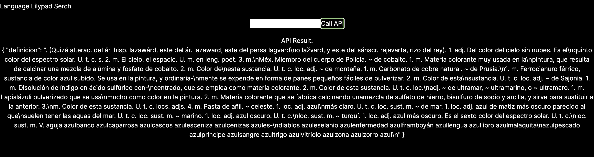

# language-lilypad

In this project, we leverage Rust to make a dictionary via async API calls to a text box. The definitions are loaded as they are typed.

Furthermore, for every word in the definition, a definition is provided via hyperlink.

Hence, when using this dictionary, one may leap-frog from word to word, as if they were lilypads.

Example : 

Rojo : color de manzanas, chiles, fresas, y más.

Color : 

De :

Manzanas

Chiles : 

Fresas : 

Y : 

Más :

