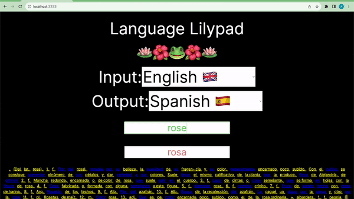

# What is Language Lilypad?

In this project, we leverage Rust to make a dictionary via async API calls to a text box. The definitions are loaded as they are typed.

Furthermore, for every word in the definition, a definition is provided via hyperlink.

Hence, when using this dictionary, one may leap-frog from word to word, as if they were lilypads.


## Getting Started

First, run the backend dictionary server in `react_version/backend`:

```bash
node server.js
```
Next, run the backend translation server in `react_version`:

```bash
python3 translation_server.py
```

Finally, run the frotend Next server in `react_version/frontend/languagelilypad`:

```bash
npx next dev --port 3333
```

Open [http://localhost:3333](http://localhost:3333) with your browser to see the result.


