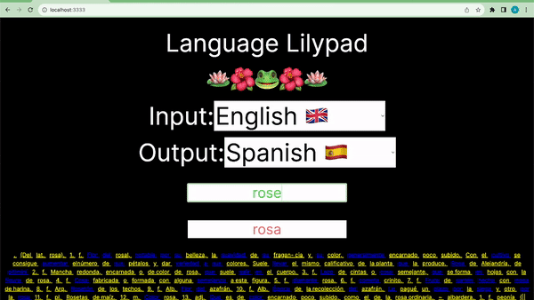

# What is Language Lilypad?

In this project, we leverage Rust to make a dictionary via async API calls to a text box. The definitions are loaded as they are typed.

Furthermore, for every word in the definition, a definition is provided via hyperlink.

Hence, when using this dictionary, one may leap-frog from word to word, as if they were lilypads.


## Getting Started

The project consists of two main components:
1.  **Dictionary Backend (Node.js/Express):** Handles word definitions using a SQLite database.
2.  **Frontend (Next.js):** The user interface for interacting with the dictionary.

### 1. Dictionary Backend
Navigate to the backend directory and start the server:
```bash
cd backend
npm install
node server.js
```
The server runs on [http://localhost:3000](http://localhost:3000).

### 2. Frontend
Navigate to the frontend directory, install dependencies, and start the development server:
```bash
cd frontend/langlilypad
npm install
npm run dev -- --port 3333
```
Open [http://localhost:3333](http://localhost:3333) with your browser to see the result.


